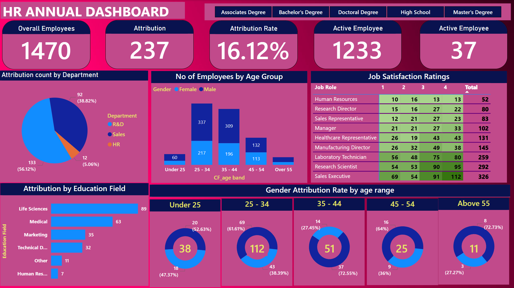
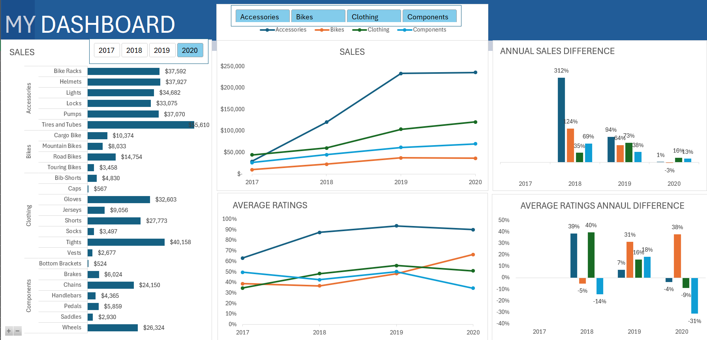

# Project 1

**Title:** [2025 HR Insights: Attrition, Satisfaction, and Demographics](https://github.com/Drswagzz/Drswagzz.github.io/blob/main/Annual_HR_Data.xlsx)

**Tools Used:** POWER BI - DAX, Horizontal Bar Chart, Donut Charts, Table, Bar Chart, Pie Chart, Text Boxes, S licers, and Filters

**Project Description:** Project Description: This project involved analyzing HR data to identify trends and patterns in employee attrition, satisfaction, and demographics from 2024 - 2025. It is designed to provide a comprehensive overview of key HR metrics. This dashboard allows stakeholders to easily monitor and analyze the organization's HR performance across different departments, employee roles, and demographic segments. The dashboard includes the following features:
Overall Employees: Displays the total number of employees, providing a snapshot of the workforce size.
Attribution: Shows the total number of employees who have left the company, offering insights into turnover.
Attribution Rate: Percentage of employees who have left, calculated to understand the rate of attrition.
Active Employees: Number of employees currently active, indicating the current workforce strength.
Attribution Count by Department: Visual representation of attrition broken down by each department with a pie chart, highlighting which areas are experiencing higher turnover.
Number of Employees by Age Group: A bar chart showing the distribution of employees by age group and gender, providing demographic insights.
Job Satisfaction Ratings: A table format that breaks down satisfaction ratings by job role, with color coding for easy interpretation.
Attribution by Education Field: A horizontal bar chart illustrating attrition rates by different educational backgrounds.
Gender Attribution Rate by Age Range: Donut charts for each age range showing the attrition rate by gender, allowing for detailed demographic analysis.
Additionally, the dashboard includes interactive slicers and filters for:
Education Level: Filter the data to view performance by different education levels such as Associates Degree, Bachelor’s Degree, Doctoral Degree, High School, and Master’s Degree.
Age Group: Focus on specific age groups to analyze HR metrics like attrition rates.
Job Role: Drill down into the performance of different job roles to understand satisfaction and turnover trends.

This setup ensures that HR managers and executives can make informed decisions based on real-time data visualization and analysis.

**Key findings:** Employee Retention Insights: Identified departments with high attrition rates, particularly R&D at 56.12%, suggesting areas where retention strategies need enhancement.
Demographic Trends: Revealed that the 25-34 age group has the highest number of employees, with a significant difference in gender distribution, which could inform diversity and inclusion initiatives.
Job Satisfaction Analysis: Highlighted that Research Scientists have the highest overall job satisfaction with a total score of 292, indicating which roles are most fulfilling and potentially aiding in talent management.
Education Field Impact: Analyzed that employees from the Life Sciences field have the highest attrition rate at 89, suggesting a need for specific support or career development programs for this group.
Age and Gender Attrition: Discovered that the 25-34 age group also has the highest attrition rate among females at 61.61%, which could prompt targeted retention programs for this demographic.

This dashboard serves as a crucial tool for the HR management team, providing clear, actionable insights that drive informed decision-making and strategic planning regarding employee management, retention, and satisfaction.

**Dashboard Overview:**

# Project 2

**Title:** [DERVID STORE DASHBOARD](https://github.com/Drswagzz/Drswagzz.github.io/blob/main/DERVID%20STORE.xlsx)

**Tools Used:** Microsoft Excel - Get pivot chart, pivot table, slicers. 

**Project Description:** Project Description: This project involved analysing product data of a multipurpose store to identify trends and patterns in sales performance from 2017 -  2020. It is designed to provide a comprehensive overview of key performance metrics. This dashboard allows stakeholders to easily monitor and analyze the company’s performance across different regions, products, and time periods. The dashboard includes the following features:
Sales by product categories: Visual representation of sales are broken down by each category and type of product with a visible primary vertical axis.
Total Units Sold per yearly: A yearly breakdown of the total units sold, providing insights into sales trends over time.
Average ratings by year: Displays the Average ratings, allowing for easy comparison of sales and profitability throughout the year using line chart and percentage.
Annual sales difference by year: Highlights the total sales generated in each year, showcasing the performance in different year.
Average Annual rating difference: visual representation of the sales difference, showcasing the uptrnd and downtrend difference by category of product

Additionally, the dashboard includes interactive slicers and timeline for:
Yearly: Filter the data to view performance for a specific year or range of year.
Country: Focus on specific category to analyze yaerly performance.
Product: Drill down into the performance of fast moving and slow moving products.

**Key findings:** Regional Profitability: Identified the most profitable countries and highlighted regions where performance could be improved.
Seasonal Trends: Revealed patterns in sales and profit that correspond with seasonal events, allowing for more strategic planning.
Top-Performing Products: Highlighted which cookie products are driving the most revenue and profit, aiding in inventory and marketing decisions.
Sales Volatility: Analyzed yearly sales fluctuations to understand market dynamics and adjust business strategies accordingly.

This dashboard serves as a crucial tool for the store’s management team, providing clear, actionable insights that drive informed decision-making and strategic planning.

**Dashboard Overview:**

# Project 3

**Title:** Player Database: Structured Analysis Queries for Football Team, Player Attributes and Performance Insights using SQL Data and Manipulation and interogation

**SQL Code::** [Football Data SQL Code](https://github.com/Drswagzz/Drswagzz.github.io/blob/main/football_data.sql)

**SQL Skills Used:** Data Retrieval (SELECT): Queried and extracted specific fields such as player name, position, height, and age from the "Football Players Data" table to gather detailed information.
Data Filtering (WHERE): Applied multiple filtering criteria to narrow down the dataset, including:
Filtering by team (e.g., players in the "Arizona" team).
Filtering by position (e.g., Wide Receivers).
Filtering by height (e.g., taller than 6 feet 2 inches).
Filtering by college (e.g., attended "Washington").
Filtering by age (e.g., players 25 years old or younger).
Identifying missing data (e.g., records with missing Age values).
Data Deletion (DELETE): (DDL) Removed incomplete or irrelevant records by deleting rows with null values in the "Year" column to ensure data quality.
Data Aggregation (AVG): Calculated the average height of players by position using the AVG function, with partitioning for positional groups.
Data Sorting and Ranking (ORDER BY, TOP): Used ORDER BY to rank players based on height and retrieved the tallest players from the "New Orleans" team using the TOP keyword.
Conditional Data Retrieval (LIKE): Used the LIKE operator to identify records with missing or specific data patterns, such as identifying players with "n/a" in the Age field.
Data Source Specification (FROM): Defined the "Football Players Data" table as the source of all queries to structure retrieval and filtering of information.
Partitioning for Insights (OVER, PARTITION BY): Leveraged window functions (OVER and PARTITION BY) to calculate grouped averages (e.g., average height by position) while retaining individual row-level details.

This combination of SQL techniques ensures a comprehensive, efficient, and precise approach to extracting insights from the "Football Players Data" dataset.

**Project Description:**
This project involves analyzing a comprehensive dataset of football players to extract valuable insights about their teams, attributes, and performance metrics. The primary goal is to facilitate a structured exploration of player and team data, leveraging SQL queries to provide actionable intelligence for stakeholders. The analysis is designed to highlight key attributes such as player positions, physical characteristics, experience, and team affiliations, enabling a deeper understanding of the dataset. Below are the main features of the analysis:
Team Analysis:
Queries to identify all players associated with specific teams (e.g., "Arizona"), providing a team-wise breakdown of player details such as names, colleges, and ages.
Player Position Insights:
Extraction of data for players in specific positions, such as "WR" (Wide Receiver), enabling position-focused analysis of player attributes.
Height and Weight Analysis:
Queries to identify players taller than a specific height (e.g., 6 feet 2 inches) or weighing more than 250 pounds, offering insights into the physical characteristics of players.
College Data Analysis:
Identification of players who attended specific colleges (e.g., "Washington"), facilitating the exploration of college-to-professional transitions.
Age-Based Segmentation:
Queries to list players who are 25 years old or younger, or to find players with missing age data, allowing age-based segmentation of the dataset.
Rookie Identification:
Filtering players classified as rookies (Exp = 'R') to focus on new entrants in the professional football arena.
Performance Metrics:
Queries to calculate the average height of players by position and identify the tallest player within a specific team (e.g., "New Orleans"), providing insights into performance-impacting physical traits.
Additionally, the project involves data preprocessing tasks such as removing records with missing critical information (e.g., null years). These queries ensure clean and reliable data for analysis.
Interactive Exploration and Insights:
The structured SQL queries allow stakeholders to explore and drill down into specific aspects of the data:
Position-Based Grouping:
Calculate average physical metrics by position, offering insights into positional requirements.
Yearly and Team-Based Analysis:
Focused queries to analyze player data based on specific teams or conditions (e.g., tallest players, weight categories).
This analytical approach offers a scalable framework for exploring and understanding football player data at both granular and aggregated levels.

**Key findings:**
Team-Based Player Insights: Identified players associated with specific teams, such as the "Arizona" team, enabling a detailed team-wise analysis of player demographics, college affiliations, and age distribution.
Position-Specific Metrics: Extracted detailed information about players in specific positions, such as Wide Receivers (WR), allowing stakeholders to focus on position-specific attributes and trends.
Physical Attributes Analysis: Identified players exceeding key physical thresholds, such as a height of 6 feet 2 inches or a weight of 250 pounds, providing insights into the physical profiles prevalent in the league.
College Representation: Highlighted players from specific colleges, such as "Washington," facilitating an understanding of college-to-professional transitions and recruitment patterns.
Age Group Segmentation: Segmented players into age-based categories, including those 25 years old or younger, and identified records with missing age data to ensure data completeness and reliability.
Rookie Identification: Pinpointed rookie players (Exp = 'R') in the dataset, enabling a focused analysis of new entrants and their potential contributions to the teams.
Tallest Players by Team: Identified the tallest players within specific teams, such as the tallest player on the "New Orleans" team, offering a deeper look into height-related positional advantages.
Average Height by Position: Calculated the average height of players by position, revealing key positional physical characteristics and helping evaluate role suitability.
This analysis provides actionable insights into team composition, player attributes, and performance-related metrics, empowering stakeholders to make informed decisions regarding recruitment, training, and performance optimization.

**Technology used:** SQL server

# Project 4

**Title:** Comprehensive SQL Queries for Football Player Data Analysis:  Physical Attributes  on Heights, Weights, Rankings, and Team Insights  

**SQL Code:** [Europeans Players Data SQL Code](https://github.com/Drswagzz/Drswagzz.github.io/blob/main/European_players.sql)

**SQL Skills Used:** Data Retrieval (SELECT): Queried player details like name, position, height, and age to extract specific insights.
Data Filtering (WHERE): Applied conditions to refine results, including filtering by team, position, height, age, and weight.
Data Aggregation (AVG, MAX, MIN, COUNT): Calculated metrics like average height and maximum weight by position or team.
Sorting and Ranking (ORDER BY, RANK, ROW_NUMBER): Ranked players by age and weight within their teams and sorted data for analysis.
Conditional Retrieval (LIKE, IN): Identified patterns (e.g., missing data) and grouped players with shared attributes (e.g., last names).
Data Deletion (DELETE): Removed incomplete rows to maintain data quality.
Grouping and Partitioning (GROUP BY, PARTITION BY): Summarized data, like tallest players by college or positional averages, while preserving row-level details.
Nested Queries: Compared individual metrics against group averages or thresholds.
Data Source Specification (FROM): Defined source tables for structured data analysis.
These SQL techniques were used to analyze player data for trends, comparisons, and rankings.

**Project Description:** This project focuses on analyzing football player data to extract meaningful insights and trends using advanced SQL techniques. The dataset comprises detailed information on players, including their physical attributes, performance metrics, and affiliations. The objective is to answer various queries related to player characteristics, team dynamics, and positional statistics.

Key Objectives:
Player Characteristics: Analyze and compare player attributes like height, weight, and age across different teams and positions.
Positional Insights: Calculate averages, such as height and weight, for players in specific positions to identify standout performers.
Team Dynamics: Evaluate player distributions based on experience and performance, identifying trends within teams.
Height and Weight Analysis:
Identify the tallest and shortest players by college and position.
Find players exceeding average height or weight metrics for their team or position.
Ranking and Filtering: Rank players by age and weight within their teams and filter data based on conditions like age, height, and college attended.
Data Quality and Maintenance: Ensure data integrity by removing incomplete records and identifying missing values.
Outcome:
The project delivers a robust analysis of football player data, providing actionable insights for teams, coaches, and analysts. By leveraging SQL's advanced capabilities, the analysis uncovers patterns and trends critical for decision-making in player recruitment, training, and performance evaluation.
Outcome:
This project delivers actionable insights into player demographics, performance, and trends, enabling better team management, recruitment strategies, and data-driven decision-making. The queries provide a detailed understanding of player attributes by team, position, and college while addressing specific analytical questions.
 
Technology used: SQL server
 

